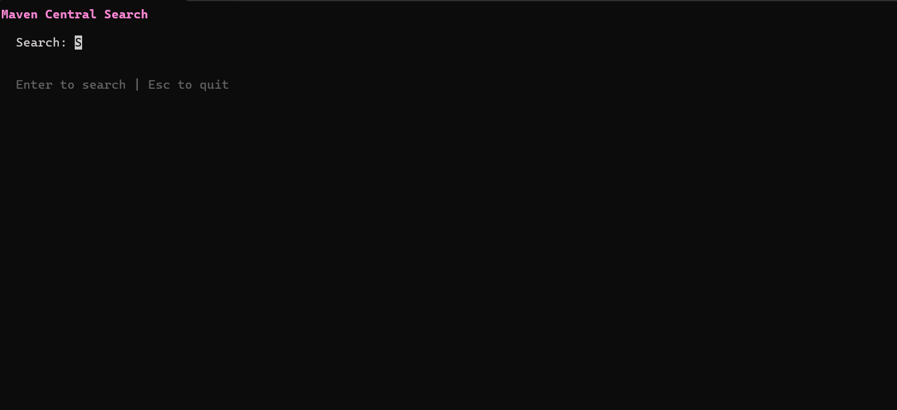

# mvns - Maven Central Search TUI 🚀

**mvns** a fast interactive TUI to browse and search the Maven Repository.

**Cross-platform support:** Works on **Linux**, **macOS** (Intel & Apple Silicon), and **Windows**.




## 🚀 Installation

### From Binary
Download the latest binary for your OS from the [Releases](https://github.com/maher90-90/mvns/releases) page.

### From Source
```bash
go install github.com/maher90-90/mvns@latest
```

## 🎮 Usage

Simply run `mvns` to start the interactive interface:
```bash
mvns
```

### Shortcuts
| Key | Action |
|-----|--------|
| `/` or `s` | **Global:** Jump back to search input from any screen |
| `Tab` or `→` | Accept auto-completion suggestion |
| `Enter` | Trigger search or select item |
| `Up`/`Down` or `j`/`k` | Navigate results/versions |
| `n` / `p` | Next / Previous page |
| `Tab` | Switch build tool format (Maven/Gradle) |
| `c` | Cycle dependency scope (`compile`, `test`, `provided`, `runtime`) |
| `Ctrl+R` | Force refresh (bypass cache and re-fetch) |
| `Esc` | Go back or Quit |

### CLI Mode (Non-interactive)
You can also use `mvns` directly for scripts or quick lookups:
```bash
# Launch TUI directly with results for a query
mvns --query junit-jupiter

# Scripting mode: Print snippet to stdout
mvns --query guice --format maven

# Clear the local cache
mvns --clear-cache
```

## 📄 License
Distributed under the MIT License. See `LICENSE` for more information.

---
Built with ❤️ using [Bubble Tea](https://github.com/charmbracelet/bubbletea).
